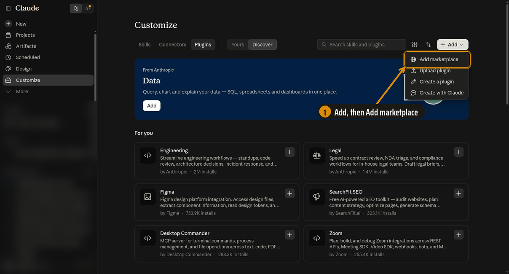
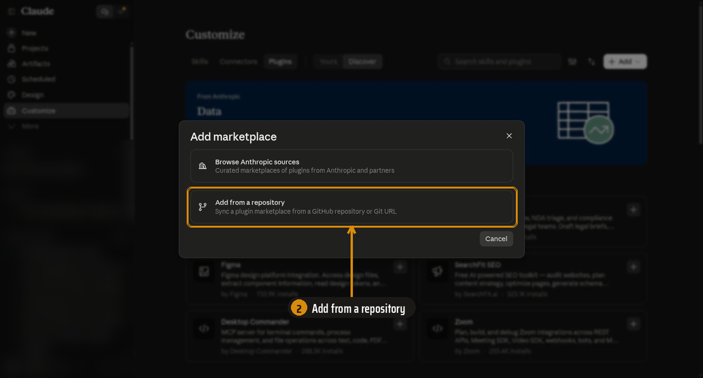
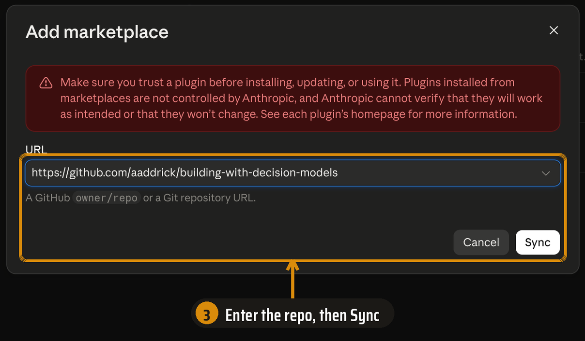
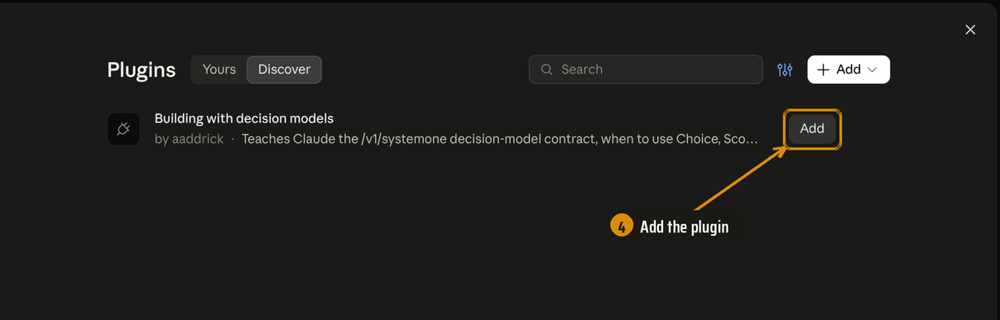
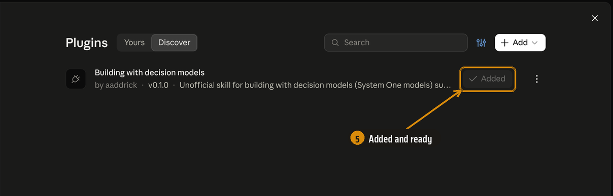
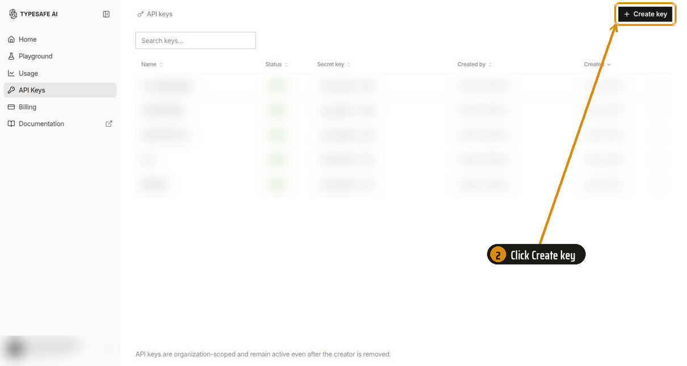
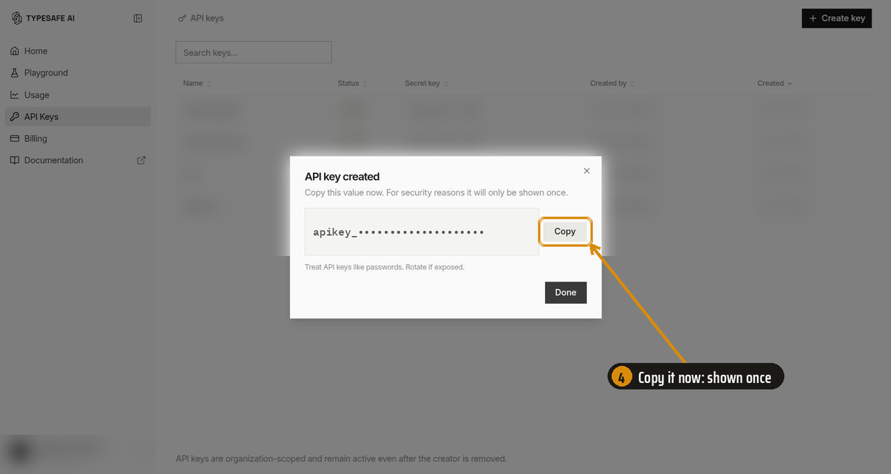

<p align="center">
  <strong>Building with Decision Models</strong><br>
  <em>为你的编程智能体提供带校准置信度的类型化决策。</em><br>
  <em>Jev、Clef、pplx-decider、ai_decide、Ollama 等等。链接到 450 多个项目，按形态分类。</em>
</p>

<p align="center">
  <a href="../../LICENSE"></a>
  <a href="../workflows/checks.yml"></a>
</p>

<p align="center">
  <a href="https://www.linkedin.com/in/aaddrick/">在 LinkedIn 上联系我！</a>
</p>

<p align="center">
  <a href="../../README.md">English</a> ·
  <strong>简体中文</strong> ·
  <a href="README.ja.md">日本語</a> ·
  <a href="README.ko.md">한국어</a> ·
  <a href="README.vi.md">Tiếng Việt</a> ·
  <a href="README.pt-BR.md">Português (BR)</a> ·
  <a href="README.it.md">Italiano</a>
</p>

> [!NOTE]
> 这是一个非官方的社区技能。它不是由 TypeSafe AI、Cloudflare、Perplexity、OpenAI、Databricks、AWS、Ollama 或它涉及的任何其他提供商制作、审核或认可的。参见[与官方 TypeSafe 技能的关系](#与官方-typesafe-技能的关系)。

编程智能体把决策模型当作又一个聊天模型。这个技能教它们为决策模型做设计：类型化的问题、校准过的置信度、各家提供商之间的差别，以及指向 450 多个社区项目的链接，按工作方式分类，每种模式附一个代码草图。它可以安装在 Claude Code、Codex、Antigravity CLI、Muse 和 Muse Code 中。

决策模型也叫 [System One](https://docs.typesafe.ai/concepts/system-one) 模型，它不生成文本。你给它发送内容和一组类型化的问题，它对每个问题返回一个值和一个概率，通常只需几百毫秒甚至更短：

- **Choice** 从列表中选出一个选项。例如：把工单分派给账单、物流或客服。
- **Score** 把内容放到一个由你描述的等级上。例如：在"忽略规格"到"符合规格"之间给一个 pull request 打分。
- **Noul** 给出一个是/否陈述为真的概率。例如："这条 shell 命令会删除项目之外的文件。"

TypeSafe 的 [Jev](https://docs.typesafe.ai/introduction) 在 2026-09-15 开创了这个类别。三周之内，其他厂商也推出了使用同样三种问题类型的模型：

| 类型 | 模型 | 调用方式 |
|---|---|---|
| 托管 | TypeSafe Jev、Cloudflare Clef 和 Clef-flash、Perplexity pplx-decider、OpenAI Decisions API（`gpt-6-luna`）、System1 Models、Strom | HTTP API，各有各的密钥 |
| 在你的数据仓库里 | Databricks `ai_decide()` | SQL 函数或 REST |
| 在你的机器上 | 通过 Ollama 运行的 Nimble 和 Tev1、Kev、Laya、Strands Decider、CLM-8B | 本地服务器，无需密钥 |
| 通过一个网关 | OpenRouter、Vercel AI Gateway、LLM Gateway、Pydantic AI | 一个密钥或一个客户端对应多个模型 |

它们共享理念，但不一定共享传输格式，准确度也各不相同。这个技能给智能体提供共通的规则、每个提供商一个参考文件，以及哪个模型擅长什么的实战证据。

## 安装

<details>
<summary><strong>Claude Code</strong></summary>

```bash
claude plugin marketplace add aaddrick/building-with-decision-models
```

```bash
claude plugin install building-with-decision-models@building-with-decision-models
```

你在写决策模型代码时，技能会自动加载。想手动加载，输入：

```
/building-with-decision-models:building-with-decision-models
```

</details>

<details>
<summary><strong>Claude Desktop、Cowork 和 claude.ai</strong></summary>

**第 1 步。** 打开 **Customize > Plugins**，依次选择 **Add** 和 **Add marketplace**。



**第 2 步。** 选择 **Add from a repository**。



**第 3 步。** 输入 `aaddrick/building-with-decision-models` 或完整的 GitHub URL，然后选择 **Sync**。如果对话框里有 **Sync automatically**，保持开启，插件会随本仓库一起更新。



**第 4 步。** 选择 **Building with decision models** 旁边的 **Add**。



**第 5 步。** 按钮变为 **Added**，列表中显示版本号。同一账号下的桌面应用和 Cowork 中也会出现该插件。



</details>

<details>
<summary><strong>Codex</strong></summary>

```bash
codex plugin marketplace add aaddrick/building-with-decision-models
```

```bash
codex plugin add building-with-decision-models@building-with-decision-models
```

开启一个新线程。任务匹配时，Codex 会加载这个技能。想手动加载，输入：

```
$building-with-decision-models:building-with-decision-models
```

</details>

<details>
<summary><strong>Antigravity CLI</strong></summary>

```bash
agy plugin install https://github.com/aaddrick/building-with-decision-models
```

检查是否已安装：

```bash
agy plugin list
```

开启一个新会话。任务匹配时，Antigravity CLI 会加载这个技能。想手动加载，输入：

```
/building-with-decision-models:building-with-decision-models
```

从 Gemini CLI 迁移过来？如果 `agy plugin import gemini` 已经导入了这个扩展，也请运行上面的安装命令，用当前版本替换导入的副本。

</details>

<details>
<summary><strong>Muse (muse.ai)</strong></summary>

Muse 从它自己电脑上的 `~/workspace/skills/` 加载技能。把这条命令粘贴到 Muse 对话里，让 Muse 运行它：

```bash
curl -fsSL https://raw.githubusercontent.com/aaddrick/building-with-decision-models/main/scripts/install_muse.sh | bash
```

脚本会把技能文件夹复制到那里，并把 `SKILL.md` 的头部改写成 Muse 能读取的格式。开始一个新对话。任务匹配时，Muse 会加载这个技能。要更新，再运行一次这条命令。

</details>

<details>
<summary><strong>Muse Code</strong></summary>

克隆仓库：

```bash
git clone https://github.com/aaddrick/building-with-decision-models.git
```

为所有项目安装这个技能：

```bash
muse skills install building-with-decision-models/skills/building-with-decision-models --scope user
```

检查是否安装成功：

```bash
muse skills list
```

开始一个新会话。任务匹配时，Muse Code 会加载这个技能。想手动加载，输入：

```
/building-with-decision-models
```

</details>

<details>
<summary><strong>其他任何能读取 SKILL.md 的智能体</strong></summary>

把 `skills/building-with-decision-models/` 文件夹复制到你的智能体的技能文件夹里。保留整个文件夹。`SKILL.md` 会链接到它旁边的文件。

</details>


## 连接一个模型（可选，推荐）

不连接任何模型，这个技能也能用。连接一个之后，智能体可以在代码进入你的项目之前，用真实的端点检查它的设计。这样能发现写错的字段名，以及模型的理解与你本意不同的问题。

<details>
<summary><strong>本地、免费、无需密钥</strong>（Ollama）</summary>

<br>

安装 [Ollama](https://ollama.com/download) 0.35 或更新版本，然后拉取一个决策模型：

```bash
ollama pull nimble
```

检查智能体能否访问它：

```bash
curl -s http://localhost:11434/api/version
```

本地模型可以免费检查请求的结构。它的准确度和校准与托管模型不同，所以这个技能会告诉智能体，不要在两者之间照搬阈值。

</details>

<details>
<summary><strong>托管：哪个密钥放进哪个变量</strong></summary>

<br>

| 提供商 | 变量 | 获取密钥 |
|---|---|---|
| TypeSafe Jev | `TYPESAFE_API_KEY` | [console.typesafe.ai](https://console.typesafe.ai/)（步骤见下文） |
| Cloudflare Clef | `CLOUDFLARE_AUTH_TOKEN` 和 `CLOUDFLARE_ACCOUNT_ID` | Cloudflare 控制台，Workers AI |
| Perplexity pplx-decider | `PERPLEXITY_API_KEY` | Perplexity API 设置 |
| OpenAI Decisions API | `OPENAI_API_KEY` | OpenAI 平台 |
| System1 Models | `SYSTEM1_API_KEY` | system1models.ai |
| Strom (Uprelic) | `UPRELIC_API_KEY` | platform.uprelic.com |
| OpenRouter | `OPENROUTER_API_KEY` | openrouter.ai |
| Vercel AI Gateway | `AI_GATEWAY_API_KEY` | Vercel 控制台 |
| LLM Gateway | `LLM_GATEWAY_API_KEY` | llmgateway.io |
| Databricks `ai_decide` | 你的工作区凭据 | Databricks 工作区（SQL 仓库不需要在智能体的 shell 中放密钥） |

`skills/building-with-decision-models/providers/` 中的每个提供商文件都写明了它的变量和调用方式。按下一节的方法保存密钥。

</details>

<details>
<summary><strong>创建、保存密钥及排查问题</strong></summary>

<br>

<details>
<summary><strong>示例：创建 TypeSafe 密钥</strong>（在 TypeSafe 控制台中分四步完成）</summary>

**第 1 步。** 登录 [console.typesafe.ai](https://console.typesafe.ai/)，在侧边栏中打开 **API Keys**。


**第 2 步。** 点击右上角的 **Create key**。



**第 3 步。** 按密钥的使用位置给它命名，比如机器名或智能体名。然后点击 **Create key**。


**第 4 步。** 现在就复制密钥。控制台只显示一次。如果弄丢了，就新建一个，并撤销旧的。



</details>

<details>
<summary><strong>保存密钥</strong>（macOS、Linux、Windows）</summary>

把所有密钥放在同一个文件里，只有你能读取，每个提供商一行 `export`。下面的命令以 `TYPESAFE_API_KEY` 为例。换成其他提供商时，使用上表中它的变量，并在同一个文件里加一行，不要新建文件。智能体经常在没有终端的情况下启动 shell，所以每一节都会把密钥放在这些 shell 能看到的地方。选择你的系统。

<details>
<summary><strong>macOS</strong>（zsh，默认 shell）</summary>

把密钥保存到私有文件：

```bash
mkdir -p ~/.config/decision-models && umask 077 && printf 'export TYPESAFE_API_KEY=%s\n' 'YOUR_KEY' >> ~/.config/decision-models/env
```

从 `~/.zshenv` 加载它。每个 zsh 都会读取这个文件，包括智能体在没有终端时启动的 shell。`~/.zshrc` 只会被交互式 shell 读取。

```bash
echo '[ -f ~/.config/decision-models/env ] && . ~/.config/decision-models/env' >> ~/.zshenv
```

打开一个新终端检查一下。这条命令打印的是密钥的长度，而不是密钥本身：

```bash
echo ${#TYPESAFE_API_KEY}
```

</details>

<details>
<summary><strong>Linux 使用 bash</strong>（Ubuntu、Debian、Mint、Fedora、Arch）</summary>

把密钥保存到私有文件：

```bash
mkdir -p ~/.config/decision-models && umask 077 && printf 'export TYPESAFE_API_KEY=%s\n' 'YOUR_KEY' >> ~/.config/decision-models/env
```

在 `~/.bashrc` 的**顶部**加载它。Ubuntu、Debian、Mint 和 Arch 的 `~/.bashrc` 开头有一行，会在没有连接终端时提前退出。写在这道检查下面的行永远不会为智能体的 shell 执行。文件顶部在每个发行版上都是安全的：

```bash
sed -i '1i [ -f ~/.config/decision-models/env ] \&\& . ~/.config/decision-models/env' ~/.bashrc
```

打开一个新终端检查一下：

```bash
echo ${#TYPESAFE_API_KEY}
```

</details>

<details>
<summary><strong>Linux 使用 zsh</strong></summary>

按照 macOS 的步骤操作。zsh 在 Linux 上也以同样的方式读取 `~/.zshenv`。

</details>

<details>
<summary><strong>Linux 使用 fish</strong></summary>

fish 会读取 `~/.config/fish/conf.d/` 中的每个文件，无论有没有终端：

```fish
mkdir -p ~/.config/fish/conf.d; and echo 'set -gx TYPESAFE_API_KEY YOUR_KEY' >> ~/.config/fish/conf.d/decision-models.fish; and chmod 600 ~/.config/fish/conf.d/decision-models.fish
```

```fish
string length -- $TYPESAFE_API_KEY
```

</details>

<details>
<summary><strong>Windows</strong>（PowerShell）</summary>

把密钥保存为用户环境变量。新打开的终端和应用能看到它，已经打开的终端看不到：

```powershell
[Environment]::SetEnvironmentVariable('TYPESAFE_API_KEY', 'YOUR_KEY', 'User')
```

打开一个新终端检查一下：

```powershell
$env:TYPESAFE_API_KEY.Length
```

**WSL：** 默认情况下，Windows 变量不会传到 WSL 中。在 WSL 里，请按照 Linux 使用 bash 的步骤操作。

</details>

<details>
<summary><strong>桌面应用和 IDE 扩展</strong></summary>

从程序坞、开始菜单或桌面启动器打开的应用不会读取你的 shell 文件。

- **Windows：** 上面设置的用户环境变量已经覆盖了这些应用。
- **Linux（systemd）：** 把 `TYPESAFE_API_KEY=YOUR_KEY` 这一行加入 `~/.config/environment.d/decision-models.conf`，然后注销并重新登录。
- **macOS：** 从终端启动应用，或者在应用自己的设置中设置这个变量。macOS 没有简单的、桌面应用会读取的按用户配置文件。

</details>

</details>

<details>
<summary><strong>如果智能体看不到密钥</strong></summary>

让智能体运行 `echo ${#TYPESAFE_API_KEY}`（在 Windows 上是 `$env:TYPESAFE_API_KEY.Length`），把 `TYPESAFE_API_KEY` 换成你的提供商的变量。如果它打印出 `0` 或什么都没打印，按顺序检查以下几项：

- **你在保存密钥之前就启动了智能体。** 智能体的 shell 会复制启动它的程序的环境。退出智能体，然后从一个新终端启动它。
- **你从程序坞、开始菜单或 IDE 启动了智能体。** 这些应用不会读取你的 shell 文件。参见上面的"桌面应用和 IDE 扩展"。
- **Codex 过滤了环境变量。** 如果 `~/.codex/config.toml` 在 `[shell_environment_policy]` 下设置了 `include_only`，把你的变量加进去。如果它设置了 `ignore_default_excludes = false`，Codex 会丢弃名字中带有 `KEY` 或 `TOKEN` 的所有变量。删掉那一行。
- **WSL。** Windows 变量不会传到 WSL 中。按照 Linux 的步骤在 WSL 里保存密钥。

</details>

</details>

## 里面有什么

技能分层加载，智能体只读任务需要的部分。

| 文件 | 内容 | 智能体何时读取 |
|---|---|---|
| `SKILL.md` | 选哪个提供商和哪种原语、11 条设计规则、如何使用概率和置信度、如何安全地更换模型、常见错误 | 每个决策模型任务 |
| `providers/jev.md` | 作为参照的 `/v1/systemone` 契约：HTTP API、Python 和 JavaScript SDK、限制、错误、环境变量 | 写代码时 |
| `providers/*.md` | 10 个提供商文件（Clef、Perplexity、OpenAI、Databricks、Ollama 和 Kev、欧盟托管商、网关、Pydantic AI、开放权重模型）：各自与 Jev 有何不同，并附来源 | 针对该提供商时 |
| `models/*.md` | 9 个模型文件（Clef、Nimble、Laya、Kev、CLM-8B、pplx-decider、GPT-6 Luna、Strands Decider 及其他）加一个索引：实际遇到的限制、校准、每个模型擅长和失败的地方，以及按形态分的笔记 | 在 Jev 以外的模型上运行时 |
| `patterns.md` | 4 种官方模式，以及来自 18 份 cookbook 的技巧和阈值 | 设计工作流时 |
| `choosing-and-switching-models.md` | 如何比较模型、重新拟合阈值、影子运行并切换，附换过模型的人的经验和现有的基准测试 | 选择、比较或更换模型时 |
| `prior-art/INDEX.md` | 从"我想做什么"到形态的映射，以及在所有模型上都失败过的想法的一行标题 | 设计新东西之前 |
| `prior-art/bad-fits.md` | 在任何模型上都失败过的想法，附证据和链接。只在某个模型上失败的情况写在它的 `models/` 文件里 | 设计看起来像已知的不适用场景时 |
| `prior-art/*.md` | 12 个形态文件：代码草图、适用于任何模型的实战经验和两三个代表性项目，每条都标注了所用模型 | 每次设计读一两个 |
| `prior-art/projects/*.md` | 每个形态的完整项目链接列表，按子类型分组，每条都标注了所用模型 | 需要更多示例时 |
| `prior-art/more-indexes.md` | 更大的外部目录，收录决策模型项目和基准测试 | 库里没有匹配项时 |

## 先例库

大多数目录按行业给项目分类。这个库按实现形态分类。游戏机器人、无人机和交易机器人是同一种形态：控制循环。这样分类后，三者共用一份代码草图和一套实战经验。每一条都写明了它运行在哪个模型上，这样在 Laya 上得到的经验就不会被误当成在 Jev 上得到的。12 种形态如下：

- **[控制循环](../../skills/building-with-decision-models/prior-art/control-loops.md)**：游戏、无人机、机器人、市场。
- **[从候选中选择](../../skills/building-with-decision-models/prior-art/select-from-candidates.md)**：浏览器和手机智能体、不用 LLM 的工具调用、信息抽取、路由器。
- **[闸门](../../skills/building-with-decision-models/prior-art/gates.md)**：工具调用审批、"完成"检查、CI、资金、内容。
- **[流过滤](../../skills/building-with-decision-models/prior-art/stream-filters.md)**：垃圾内容过滤、内容审核、邮件、日志、批量标注。
- **[排序与匹配](../../skills/building-with-decision-models/prior-art/ranking-and-matching.md)**：重排序器、实体匹配、图和分类体系遍历。
- **[评判与评估](../../skills/building-with-decision-models/prior-art/judges-and-evals.md)**：基于评分标准的评判、轨迹评分、把代码审查当作分诊、对这些模型本身的基准测试。
- **[增量与实时](../../skills/building-with-decision-models/prior-art/incremental-realtime.md)**：配音、语音、网络摄像头、由按键驱动的界面。
- **[智能体上下文与记忆](../../skills/building-with-decision-models/prior-art/agent-context-memory.md)**：压缩、记忆闸门、停下来提问的决策、投入度控制。
- **[与 LLM 搭配](../../skills/building-with-decision-models/prior-art/llm-pairing.md)**：规划者与执行者、先验证再升级、按模型档位路由、蒸馏。
- **[把答案当数据](../../skills/building-with-decision-models/prior-art/research-and-features.md)**：经典模型的特征、研究工具、分析用的数据列、基准测试。
- **[嵌入基础设施](../../skills/building-with-decision-models/prior-art/embedding-in-infrastructure.md)**：SQL 函数、网关、MCP 服务器、CI 钩子、Home Assistant。
- **[图像和其他非文本输入](../../skills/building-with-decision-models/prior-art/images-and-multimodal.md)**：截图闸门、图像审核、摄像头循环、文档。

库旁边还有两份指南：[模式](../../skills/building-with-decision-models/patterns.md)收录官方模式和 cookbook 阈值；[选择和切换模型](../../skills/building-with-decision-models/choosing-and-switching-models.md)收录基准测试、兼容性、正面对比，以及如何换到新提供商而不弄坏阈值。

索引还用一行一条的方式，列出了对决策模型普遍失败的想法：国际象棋、对数学或代码做最终判定、已有训练数据时仍用大量标签，以及不加验证就相信校准。只在某个模型上失败的情况，例如零样本使用 Laya、在紧密循环中使用托管的 Clef-flash，写在 `models/` 里该模型的文件中。一次失败的尝试，能让下一个开发者不必重蹈覆辙。

## 与官方 TypeSafe 技能的关系

TypeSafe 在 [typesafe-ai/skills](https://github.com/typesafe-ai/skills) 发布了自己的技能。它是一个只包含 Jev 设计指导的文件。涉及 API 细节时，它会在每个任务中让智能体去读线上文档。两个技能名称不同，互不冲突，所以你可以两个都安装。

这个技能覆盖所有决策模型，而不只是 Jev。它本身包含更多内容：确切的 API 结构和各提供商之间的差别、cookbook 里的阈值、社区总结的失败模式，以及先例库。智能体不用联网就能做设计，也能先看到别人已经做过什么。

决策模型变化很快，每周都有新模型出现。这个技能是 2026-10-06 时各提供商文档和社区状况的快照，它告诉智能体，出现冲突时以提供商的线上文档为准。如果有事实错误，请提交 issue 并附上来源链接。

## 致谢

关于每个 API 的事实来自该提供商的公开文档：TypeSafe AI 的文档和 cookbook、Cloudflare、Perplexity、OpenAI、Databricks、Ollama、System1 Models、Uprelic、OpenRouter、Vercel、LLM Gateway、Pydantic，以及各开放模型的 README。先例来自发布了自己项目的开发者、Hacker News 社区，以及这些索引：[awesome-jev](https://github.com/yibie/awesome-jev)、[awesome-jev-typesafe](https://github.com/valentynkit/awesome-jev-typesafe)、[JevDirectory](https://www.jevdirectory.org/resources)、[awesome-jev-use-cases](https://github.com/walidboulanouar/awesome-jev-use-cases)、[awesome-typesafe-jev](https://github.com/AbdelStark/awesome-typesafe-jev)、[amplifying.ai](https://amplifying.ai/decision-models) 和 [BenchLM](https://benchlm.ai/decision-models)。每个形态文件都链接到原始项目。

TypeSafe、Jev 和 System One 是 TypeSafe AI 的名称。Clef 和 Workers AI 属于 Cloudflare，pplx-decider 属于 Perplexity，其他所有模型名称都属于各自的开发者。本项目使用它们，只是为了说明这个技能的用途。

## 许可证

MIT。参见 [LICENSE](../../LICENSE)。
